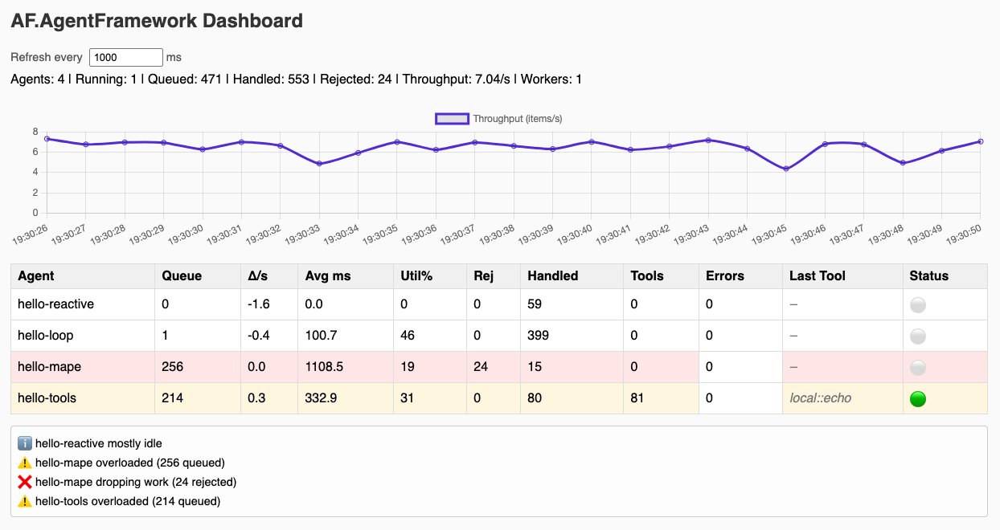

# AF.AgentFramework

[](https://www.nuget.org/packages/AF.AgentFramework/)
[](https://github.com/runemalm/AF.AgentFramework/actions/workflows/release.yml)
[](https://opensource.org/licenses/MIT)


**AF.AgentFramework** is an experimental .NET framework for building **agents** and **multi-agent systems (MAS)**.
It’s a personal learning project — but I expect it to also grow into a fully-fledged framework for others who want to both explore/learn agent-based architectures in C#/.NET and to build agentic systems for production.

The framework is rooted in **agent theory and MAS research**. My goal is to create clean, theory-aligned abstractions for:
- **Kernel** – the minimal agent core
- **Engines** – execution models (loop, reactive, etc.)
- **Runners** – input adapters that generates engine "ticks"
- **Tools** – agent-usable capabilities, e.g. external actions
- **Hosting** – integration with .NET GenericHost and application lifecycles
- **MAS** – support for multi-agent collaboration using blackboards and agent directories

## Why?

There are many frameworks for creating agentic systems, like e.g. langgraph, openai swarm, etc. just to name a couple. What I think they all lack is alignment with the agentic theory. At least if you are new to agentic architectures and are starting out.

I want to **bridge theory and practice** — building a framework that is simple enough to learn from, yet solid enough to use for real projects.

This repository is where I’m exploring:
- How agentic abstractions map to practical agent architectures, integrating with and using .NET patterns
- How concepts like **MAPE-K, Tools/Actuators, Policies, MAS and Agent Societies** can be implemented in code

## Current Status

🚧 **Work in Progress** 🚧 Right now the focus is on:
- Laying down scaffolding and core abstractions (the theory "spine")
- Adding all the base modules (Kernel, Engines, Runners, Hosting, Tools, MultiAgent)
- Building minimal examples (e.g. `HelloLoopAgent`, `HelloMapeAgent`, and `HelloReactiveAgent`) all running together in the `HelloKernel` sample

APIs are **not stable yet**. Expect things to change as I refine the abstractions.

## Live Dashboard

When running the included **HelloKernel** sample (with `HelloLoopAgent`, `HelloReactiveAgent`, and `HelloMapeAgent`),
you can open the minimal built-in dashboard at [http://localhost:6060/af](http://localhost:6060/af)
to observe agent activity and kernel state in real time.

<p align="center">
  
</p>

The dashboard is powered by the framework’s own **ObservabilityServer**, exposing live metrics from the kernel
through a lightweight HTTP interface. It visualizes throughput, queue depth, utilization, and per-agent status updates.

## HelloKernel Sample

The `HelloKernel` project demonstrates how multiple agents and engines run together
in a single host — including **loop**, **reactive**, and **MAPE-K** agents.

```csharp
using AgentFramework.Engines.Loop;
using AgentFramework.Engines.Reactive;
using AgentFramework.Hosting;
using AgentFramework.Kernel;
using AgentFramework.Kernel.Policies.Defaults;
using AgentFramework.Runners.Timers;

namespace HelloKernel;

internal class Program
{
    private static async Task Main()
    {
        Console.WriteLine("HelloKernel sample starting…");

        var policyDefaults = PolicySetDefaults.Create(
            retry: RetryOptions.Default with { MaxAttempts = 2 },
            timeout: new TimeoutOptions(null),
            scheduling: new TimeSliceAwareSchedulingPolicy()
        );

        // Build and run a minimal multi-agent host
        var host = AgentHostBuilder.Create()
            .WithKernelDefaults(policyDefaults)
            .WithKernel(() => new InProcKernelFactory())
            // loop family
            .AddEngine("loop", () => new LoopEngine("loop"))
            .AddRunner("loop", () => new TimerRunner(TimeSpan.FromSeconds(0.7), "Loop Tick"))
            .AddAgent("hello-loop", () => new HelloLoopAgent())
            .AddAgent("hello-mape", () => new HelloMapeAgent())
            .Attach("hello-loop", "loop")
            .Attach("hello-mape", "loop")
            // reactive family
            .AddEngine("reactive", () => new ReactiveEngine("reactive"))
            .AddRunner("reactive", () => new HttpMockRunner())
            .AddAgent("hello-reactive", () => new HelloReactiveAgent())
            .Attach("hello-reactive", "reactive")
            .EnableDashboard(6060)
            .Build();

        await host.RunConsoleAsync();

        Console.WriteLine("HelloKernel sample finished.");
    }
}
```

🧩 Try running it — then open the [dashboard](http://localhost:6060/af) to see all agents executing live.

## Roadmap

This is a growing list and subject to change as we go and learn.

### 🧱 Foundation
Core architectural scaffolding — defining the minimal abstractions for agents, engines, and runners.

- [x] Implement core **agent kernel** (InProcKernel, policies, scheduling)
- [x] Implement **execution engines**: LoopEngine & ReactiveEngine
- [x] Implement **runner primitives**: TimerRunner, ReactiveRunner

### 🧩 Capabilities
Expanding what agents can *do* — tools, feedback loops, collaboration, and environmental interaction.

- [ ] Add **Tools system** (external actions, pipelines, tool engine, policies, observability, ...)
- [x] Add **MAPE-K agent base** (`MapekAgentBase`) and sample
- [ ] Add **MAS primitives** (blackboard, directory, collaboration)
- [ ] Extend **runner ecosystem** (queues, routing, distributed transports, HTTP ingress, Slack Webhooks, ...)

### 🤖 Samples & Agents
Demonstrating theory in practice — progressively complex agents showcasing different patterns.

- [x] **HelloLoopAgent** – basic periodic agent using LoopEngine + TimerRunner
- [x] **HelloReactiveAgent** – event-driven agent using ReactiveEngine + HttpMockRunner
- [x] **HelloMapeAgent** – agent demonstrating the full MAPE-K control loop
- [ ] **HelloSocietyAgent** – sample MAS scenario (collaborating agents via blackboard)
- [ ] **HelloToolAgent** – agent using the ToolsEngine to invoke external actions
- [ ] **HelloBlackboardAgent** – demonstrates shared memory and coordination
- [ ] **HelloSlackAgent** – integrates with Slack ingress runner

### 🔍 Observability & Dashboard
Making the invisible visible — introspection and live visualization of agent activity and kernel state.

- [x] Add **kernel introspection API** (`IKernelInspector`, agent and queue snapshots)
- [x] Add **minimal HTTP dashboard** (`AgentFramework.Hosting.Observability`)
- [x] Add **lightweight charts** (Chart.js sparklines for queue depth, tick rate, throughput)
- [x] Add **agent-level metrics** (execution time, retries, policy outcomes)

### 📚 Ecosystem & Release
Documentation, polish, and packaging toward a stable v1.0 developer experience.

- [ ] Add **documentation site** (DocFX, API reference, guides)
- [ ] Finalize **v1.0.0 release** (stabilize APIs, add samples & polish)

## Contributing

I would love to collaborate with like-minded on this. If you are interested, please reach out.
Or, if you just find this interesting:
- ⭐ **Star this repo** to follow along
- 👀 Watch the releases for updates
- 💬 Open discussions or issues if you have ideas or feedback

## License

This project is licensed under the [MIT License](LICENSE).

*I’m building AF.AgentFramework to learn, but also hoping it can become a useful resource for others who want to explore agent-based architectures in .NET. If that sounds interesting, please give it a star and follow along!*