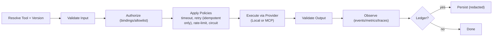

# Tools (Capabilities) in AgentFramework

> Tools are how agents turn **intention** into **action**. They expose named, versioned capabilities with clear contracts and safety policies — whether they run locally or via external MCP servers.

## Why tools?
Without tools, an agent can only plan and reason. Tools provide:  
- Clear contracts (schemas, effect levels) so side-effects are explicit and testable.  
- Reliability (timeouts, retries where safe, circuit breakers, rate limits).  
- Observability (events, metrics, tracing) to troubleshoot real systems.  
- Provider neutrality: the same surface covers local executors and MCP servers.

## Core concepts at a glance
- **Tool** — a named, versioned capability (e.g., local::fs.write, mcp::github::issues.create).  
- **Contract** — input/output schemas, declared **effect level**.  
- **Invocation & Result** — request/response with correlation, duration, and errors.  
- **Policies** — guardrails: timeout, retry (idempotent only), rate-limit, circuit breaker, budgets.  
- **Effects** — Pure, IdempotentWrite, NonIdempotentWrite, ExternalSideEffects.

## Providers
- **Local Provider** — in-proc implementations (e.g., filesystem, HTTP). Low latency, great for private/bespoke work.  
- **MCP Provider** — imports tools from external MCP servers and exposes them through the same registry. Governed by allowlists, auth, and policy overlays.

## Invocation pipeline (at a glance)

* Retries apply only to **IdempotentWrite** tools and require an **IdempotencyKey**.

## Safety model
- **Effect levels** determine what is cacheable/retriable.  
- **Idempotency** avoids duplicate side-effects during retries.  
- **Budgets & bulkheads** prevent cascading failures across tools or providers.

## Where next
- **Registry & Binding:** [registry.md](registry.md)  
- **Pipeline details:** [pipeline.md](pipeline.md)  
- **Policies:** [policies.md](policies.md)  
- **Observability:** [observability.md](observability.md)  
- **Security & secrets:** [security.md](security.md)  
- **Providers:** Local ([providers/local.md](providers/local.md)) · MCP ([providers/mcp.md](providers/mcp.md))  
- **Contracts:** [contracts/tool-contract.md](../contracts/tool-contract.md), [contracts/invocation-result.md](../contracts/invocation-result.md), [contracts/schemas.md](../contracts/schemas.md)

