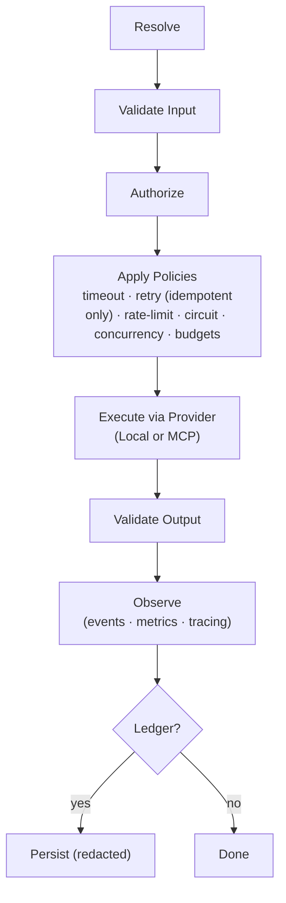

# Invocation Pipeline (Overview)

A middleware-style flow applied uniformly to all tools. The pipeline ensures contracts, safety policies, and observability are consistently enforced regardless of provider (Local or MCP).

## Stages

1. **Resolve** — pick tool + version (bindings, precedence rules).
2. **Validate Input** — schema validation with helpful, structured errors.
3. **Authorize** — role/binding checks; allowlist enforcement for imported MCP tools.
4. **Apply Policies** — timeout, retry (idempotent only), rate-limit, circuit breaker, budgets, concurrency caps.
5. **Execute** — invoke via provider (Local/MCP); streaming responses are optional/forwarded when supported.
6. **Validate Output** — schema validation; redaction hooks for sensitive fields.
7. **Observe** — emit events, metrics, and tracing spans with correlation.
8. **Ledger (optional)** — persist a redacted invocation/result pair for audit and replay.

## Retry rule (safety)

Retries are permitted **only** when the tool declares `Effect = IdempotentWrite` **and** an `IdempotencyKey` is provided in the invocation. Non-idempotent tools must not be retried automatically.

## Visual: pipeline at a glance

## Error taxonomy (high level)

- **ContractError** — input/output validation failures, unsupported versions.
- **PolicyError** — `Timeout`, `RateLimited`, `CircuitOpen`, `BudgetExceeded`, `ConcurrencyLimited`.
- **AuthError** — permission or secret issues.
- **ExecutionError** — backend/provider failures (network, service errors).
- **SystemError** — unexpected faults not classified above.

## Signals emitted

- **Events**: `ToolInvoked`, `ToolSucceeded`, `ToolFailed`, `PolicyApplied`, `RateLimited`, `CircuitOpen`.
- **Metrics** (per tool & origin): throughput (QPS), latency (p50/p95/p99), error rate, retries, saturation.
- **Tracing**: one span per invocation with tags: `tool.name`, `tool.version`, `tool.origin`, `agent.id`, `correlation.id`.

## Policy interplay

- Timeouts bound total execution per attempt.
- Retries respect backoff/jitter and maximum attempts; only for idempotent tools.
- Rate limits and concurrency caps act as bulkheads (per tool and per provider).
- Circuit breakers short-circuit unhealthy downstreams; half-open probes restore.

## See also

- [policies.md](policies.md)
- [observability.md](observability.md)
- [security.md](security.md)
- [../contracts/invocation-result.md](../contracts/invocation-result.md)
